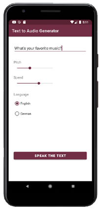

# Android App Library: Text To Speech

## About
Welcome to our Android application. The app is part of the Open Sorce [Android App Library](https://github.com/LukPle/android-app-library.git) 
and adopts all licensing and community guidelines from this project. Please use the link in order to check out the corresponding repository.

The text-to-speech app showcases a text to speech generator using a **TextToSpeech** instance. The voice output can be modified with user input from a **EditText** field,
**SeekBars** and **RadioButtons**. This serves as an example of this feature.

## Features
The program takes the text and user input of pitch and speed and creates a voice output in the selected language using all those values. 
The app offers two different languages out of the box but other ones can be added.  

## Usage
You can clone the repository into Android Studio by clicking "Get from VCS" in the Welcome Screen or navigating to "File - New - Project from Version Control" inside 
the IDE. When doing so use the URL provided by GitHub. You can run the app on your mobile device or an emulator. Feel free to modify the code or utilize this sample 
for your own project.
